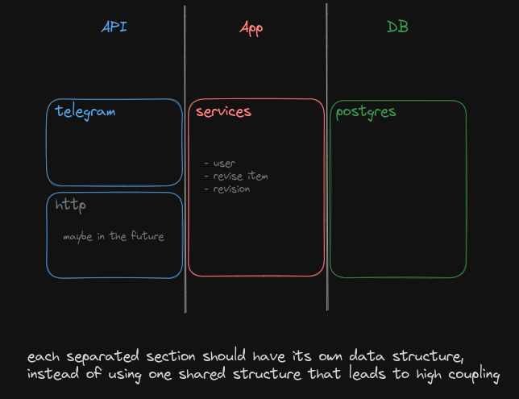
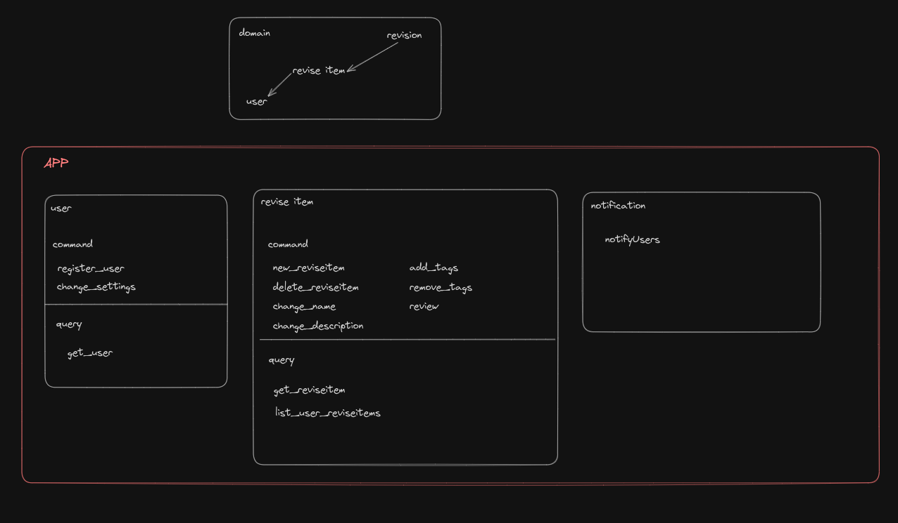

V<!-- Improved compatibility of back to top link: See: https://github.com/othneildrew/Best-README-Template/pull/73 -->
<a id="readme-top"></a>


<!-- PROJECT LOGO -->
<br />
<div align="center">

<h3 align="center">go-revise</h3>

</div>


<!-- TABLE OF CONTENTS -->
<details>
  <summary>Table of Contents</summary>
  <ol>
    <li>
      <a href="#about-the-project">About The Project</a>
      <ul>
        <li><a href="#built-with">Built With</a></li>
      </ul>
    </li>
    <li>
      <a href="#getting-started">Getting Started</a>
      <ul>
        <li><a href="#prerequisites">Prerequisites</a></li>
        <li><a href="#installation">Installation</a></li>
      </ul>
    </li>
  </ol>
</details>


<!-- ABOUT THE PROJECT -->
## About The Project

A Telegram bot designed to help you retain and reinforce information over time. Whether it's an article or video, the bot will remind you to revise it at the right time.

<details>
<summary> More details</summary>

### Intervals
The bot uses the [Spaced repetition](https://en.wikipedia.org/wiki/Spaced_repetition) technique to remind you to revise the information. The intervals are as follows:
</details>

<p align="right">(<a href="#readme-top">back to top</a>)</p>


### Built With

[![Go][go-shield]][go-url]    [![SQLite][sqlite-shield]][sqlite-url]


<p align="right">(<a href="#readme-top">back to top</a>)</p>


<!-- GETTING STARTED -->
## Getting Started
### Prerequisites

* Go version 1.23.0
* [Taskfile 3](https://taskfile.dev/installation/) 

  ```sh
    go version
    task --version
  ```

### Installation

1. Clone the repo
   ```sh
   git clone https://github.com/ARUMANDESU/go-revise.git
   ```
2. Change directory
   ```sh
   cd go-revise
   ```
3. Write the environment variables in the `.env` file
   ```dotenv
   ENV_MODE=local #local, test, dev, prod
   # sqlite3 database file name, it will be created in cache directory
   # On linux in $HOME/.cache. On Darwin, in $HOME/Library/Caches. On Windows in %LocalAppData%
   DATABASE_URL=go-revise.db
   
   TELEGRAM_TOKEN= # Telegram bot token generated by BotFather
   # URL to which Telegram will send updates.
   # Is pointed to the port on which the service listens, for local development use ngrok or similar services
   # But for dev and prod, it should be a public URL with a valid SSL certificate (https)
   TELEGRAM_WEBHOOK_URL= 
   TELEGRAM_PORT=4000  # Port on which the service will listen for updates
   TELEGRAM_URL=:$TELEGRAM_PORT 
   
   HTTP_PORT=5000
   ```
4. Run the service
   ```sh
   task local
   ```

## Testing

1. Coverage 
   ```sh
   task tc
   ```
2. Unit tests
   ```sh
   task tu
   ```
3. Integration tests
   ```sh
   task ti
   ```


<p align="right">(<a href="#readme-top">back to top</a>)</p>


## Structure





<!-- MARKDOWN LINKS & IMAGES -->
<!-- https://www.markdownguide.org/basic-syntax/#reference-style-links -->
[aitu-url]: https://astanait.edu.kz/
[aitu-ucms-url]: https://www.ucms.space/
[protofiles-url]: https://github.com/ARUMANDESU/uniclubs-protos

[go-url]: https://golang.org/
[sqlite-url]: https://www.sqlite.org/index.html

[go-shield]: https://img.shields.io/badge/Go-00ADD8?style=for-the-badge&logo=go&logoColor=white
[sqlite-shield]: https://img.shields.io/badge/SQLite-003B57?style=for-the-badge&logo=sqlite&logoColor=white